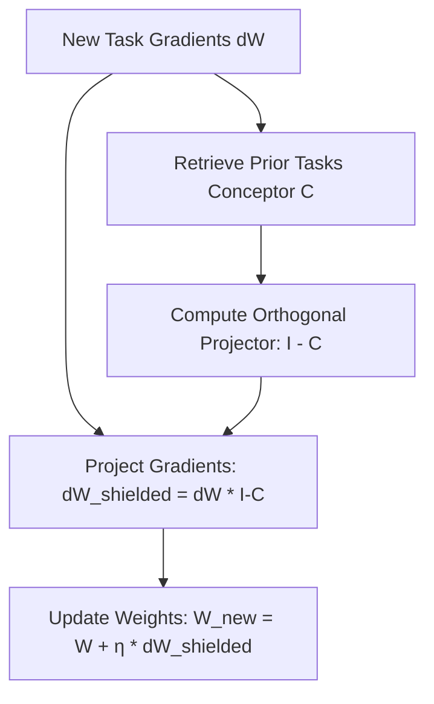

# 🛡️ Conceptor-Aided Backpropagation (CAB)

Conceptor-Aided Backpropagation (CAB) is an optimization technique designed by Xu He and Herbert Jaeger in 2018. It addresses the challenge of **catastrophic forgetting** in continual learning systems by shielding critical gradient update directions.

---

## 📐 Mathematical Mechanism

1.  **Task Conceptor:** For a learned task $T_1$, compute the matrix conceptor $C_1$ representing the activations used by the network to perform that task.
2.  **Gradient Projection:** During backpropagation for a new task $T_2$, the gradients $\nabla_W L$ are projected into the orthogonal complement of $C_1$:
    
    $$\nabla_W^{shielded} L = \nabla_W L \cdot (I - C_1)$$

This ensures that the gradient updates do not overwrite weight directions that are critical for preserving task $T_1$'s performance.

---

## 📊 Computation & State Flow

---

## ⚖️ Benefits
*   **Zero Catastrophic Forgetting:** Updates are mathematically guaranteed not to disrupt existing task representations.
*   **Continual Learning:** Allows networks to learn sequential tasks without accessing old training data.
