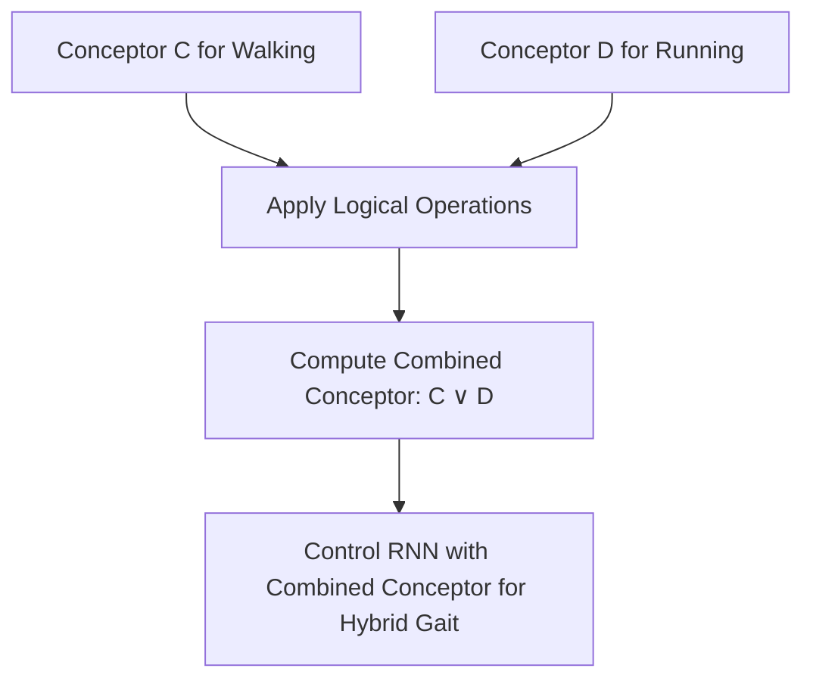

# 🎛️ Conceptor Logic / Quasi-Boolean Logic

Conceptor Logic is a mathematical framework that defines Quasi-Boolean operations directly on Conceptor Matrices. This enables semantic operations like `AND`, `OR`, and `NOT` on neural representation spaces without retraining.

---

## 📐 Logical Operations

For two conceptors $C$ and $D$, the operations are defined as:

1.  **Negation (NOT):**
    
    $$\neg C = I - C$$

2.  **Disjunction (OR):**
    
    $$C \vee D = (C + D)(C + D + \alpha^{-2}I)^{-1}$$
    
    Alternatively, using clean projection properties: $C \vee D = C + D - C \wedge D$.

3.  **Conjunction (AND):**
    
    $$C \wedge D = (C^{-1} + D^{-1} - I)^{-1}$$

---

## 📊 Computation & State Flow

---

## ⚖️ Features
*   **Zero-Shot Concept Merging:** Combine different behaviors (e.g., voice style + language) dynamically.
*   **Mathematical Consistency:** Behaves similarly to Boolean algebra on projection spaces.
