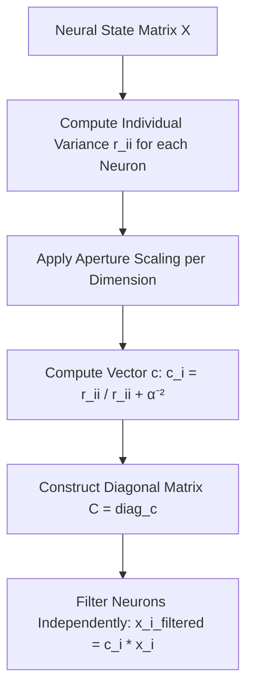

# 🔍 Diagonal Conceptors

Diagonal Conceptors were introduced by Joris de Jong in 2021 to mitigate the quadratic storage complexity ($\mathcal{O}(N^2)$) of traditional Matrix Conceptors. By constraining the conceptor to a diagonal matrix, diagonal conceptors drastically reduce parameters.

---

## 📐 Mathematical Formulation

Instead of computing a full $N \times N$ matrix, the diagonal conceptor $c$ is a vector of length $N$ representing the diagonal elements of a simplified conceptor operator.

The correlation matrix $R$ is approximated by its diagonal, or the states are scaled independently:

$$c_i = \frac{r_{ii}}{r_{ii} + \alpha^{-2}}$$

where:
*   $r_{ii} = E[x_i^2]$ is the variance of the $i$-th neuron activation.
*   $\alpha$ is the aperture.
*   The final conceptor matrix is diagonal: $C = \text{diag}(c)$.

---

## 📊 Computation & State Flow

---

## ⚖️ Trade-Offs & Complexity
*   **Space Complexity:** $\mathcal{O}(N)$ to store the diagonal vector $c$.
*   **Time Complexity:** $\mathcal{O}(N)$ to compute, avoiding any matrix inversion.
*   **Limitation:** Compromises the ability to capture spatial correlations or diagonal coupling between different neurons, leading to potential instability in complex pattern generation.
