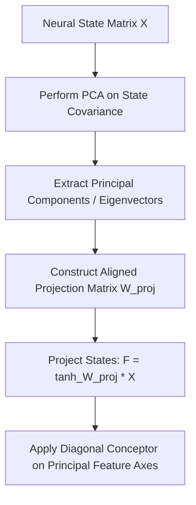

# 📈 PCA-Enhanced RFCs

PCA-Enhanced RFCs represent the latest architectural optimization for Feature Conceptors (FCs), as proposed by Antoon Bervoets in 2025. Instead of using a static, completely random projection matrix, it uses Principal Component Analysis (PCA) to structure the feature projection.

---

## 📐 Mathematical Formulation

1.  **Extract Principal Components:** Perform PCA on the reservoir or neural state matrix $X$ to find the principal directions of variance:
    
    $$X^T X = U \Sigma V^T$$

2.  **PCA-guided Projection:** Set the projection weights $W_{proj}$ using the principal components $U$ (or a combination of principal axes and random scaling) to align features with the directions of maximum information variance.
    
    $$F = \tanh(W_{proj} X)$$

3.  **Diagonal Conceptor:** Construct the diagonal filter vector $c$ over the structured projection space.

---

## 📊 Computation & State Flow

---

## ⚖️ Trade-Offs & Complexity
*   **Accuracy & Stability:** High. Significantly outperforms standard RFCs by placing projection filters along directions of optimal variance.
*   **Compute Overhead:** Requires an initial PCA computation (singular value decomposition), but the runtime inference complexity remains extremely low.
