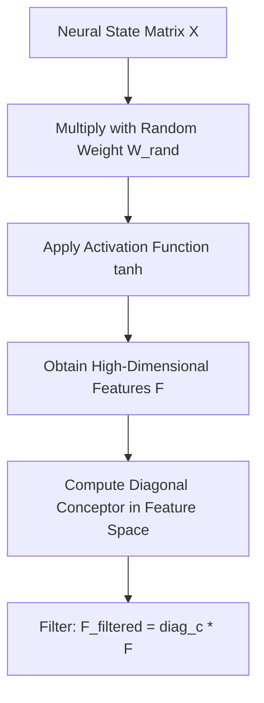

# 🎲 Random Feature Conceptors (RFCs)

Random Feature Conceptors (RFCs) expand on the concept of diagonal conceptors by projecting the low-dimensional state space into a higher-dimensional random space. This allows diagonal filters to capture complex correlations without requiring full $N \times N$ matrix operations in the original state space.

---

## 📐 Mathematical Formulation

1.  **Random Projection:** The state $X$ is projected to a higher-dimensional random feature space $F \in \mathbb{R}^{D}$ (where $D > N$):
    
    $$F = \tanh(W_{rand} X + b)$$
    
    where $W_{rand}$ is a fixed, non-trainable random projection matrix.

2.  **Diagonal Filtering:** Compute a diagonal conceptor $c \in \mathbb{R}^{D}$ in the random feature space:
    
    $$c_j = \frac{E[F_j^2]}{E[F_j^2] + \alpha^{-2}}$$

3.  **Filtering:** The states are filtered in the feature space and can be mapped back or used directly.

---

## 📊 Computation & State Flow

---

## ⚖️ Trade-Offs & Complexity
*   **Space Complexity:** $\mathcal{O}(D)$ for the diagonal conceptor.
*   **Performance:** Recovers the capacity of Matrix Conceptors to model non-linear boundaries and high-dimensional correlations, keeping computational costs linear with respect to the feature space dimension $D$.
