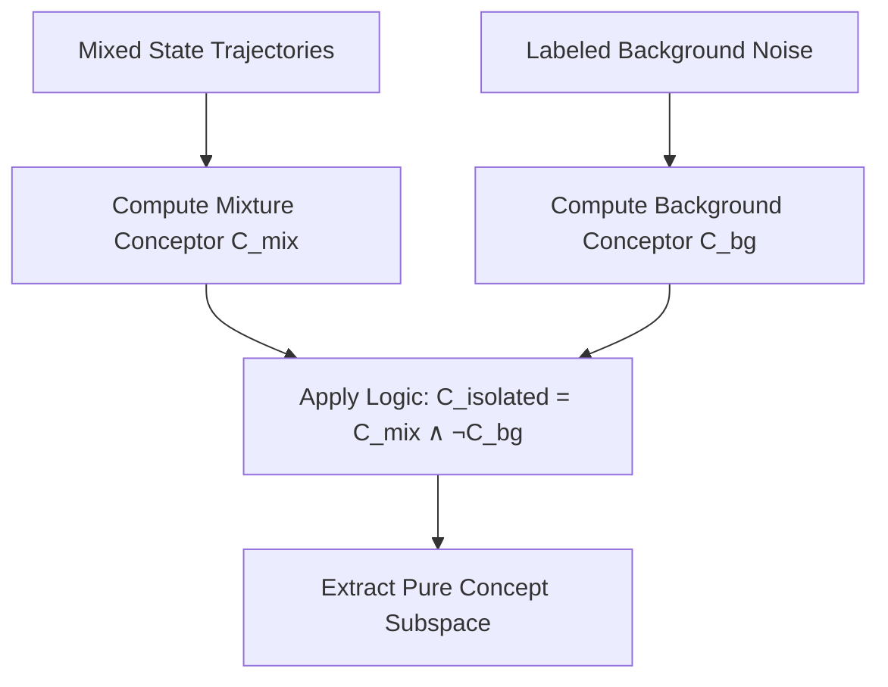

# 🏷️ Semi-Supervised Conceptors

Semi-Supervised Conceptors leverage the geometric properties of conceptor subspaces to learn and isolate distinct concepts from a mixture of labeled and unlabeled neural activation trajectories.

---

## 📐 Concept Isolation

In many real-world scenarios, neural states contain mixtures of signal and noise or overlapping trajectories. Semi-Supervised Conceptors:
1.  Compute a baseline conceptor $C_{labeled}$ on the clean, labeled subset.
2.  Use logical conceptor operations to subtract noise or background signals:
    
    $$C_{isolated} = C_{mixture} \wedge \neg C_{background}$$

3.  Set geometric boundaries (apertures) to separate target states from distraction states.

---

## 📊 Computation & State Flow

---

## ⚖️ Applications
*   **Denoising:** Isolating target dynamics in chaotic time series.
*   **Domain Adaptation:** Adapting a classifier to new domains with minimal label supervision by aligning conceptor hulls.
